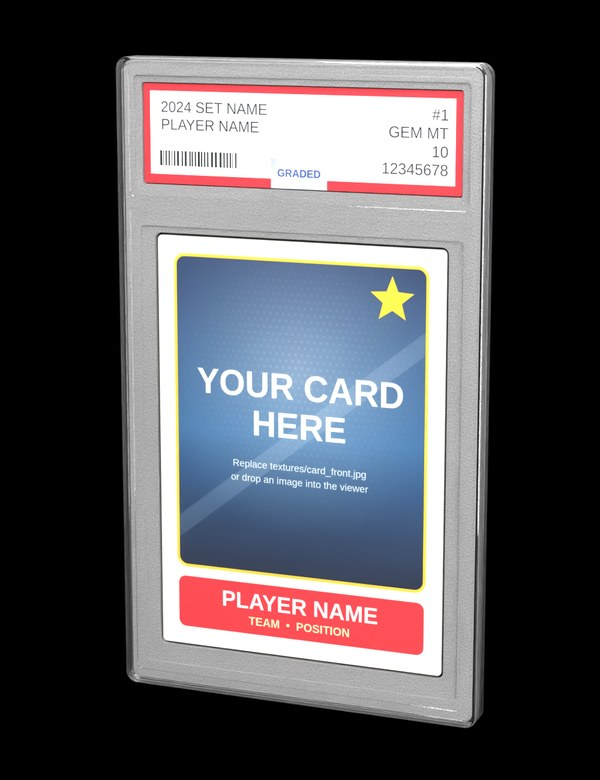

# Trading card slab

A 3D graded-card slab modelled on the reference photo: clear acrylic case with a
raised rim and divider, frosted inner holder, and a **swappable card and label**.



| File | What it is |
| --- | --- |
| `slab.glb` | The model (glTF binary, metres, standing upright, front faces +Z). |
| `slab.blend` | Same model plus a studio camera/lights for Cycles renders (F12). |
| `build_slab.py` | Blender script that generates both files. All dimensions live at the top. |
| `index.html`, `viewer.js`, `label.js` | Web/AR viewer with card upload and a label editor. |
| `textures/` | The images the model uses. Replace these to change the card or label. |

## Replacing the card and label

**In the browser (easiest):** open the viewer (`index.html`), then:

- **Card:** choose a front and back image, or drop an image onto the slab.
- **Label:** fill in the template fields, or switch to *Image* and upload your own label scan.
- **Download .glb** saves the customised model.

To run it locally:

```sh
cd slab && python3 -m http.server 8000   # then open http://localhost:8000
```

Once this folder is on `main`, the existing Pages workflow publishes it at
`https://dutchee2021.github.io/avatars/slab/`. Images and label text can also be
passed in the URL, e.g.
`?card=my_card.jpg&back=my_back.jpg&label=my_label.png` or
`?line1=1986%20FLEER&line2=MICHAEL%20JORDAN&cardNo=%2357&grade=10&cert=43569876`.

**By swapping files:** overwrite the images in `textures/` and rebuild:

```sh
blender -b -P build_slab.py
# or point at images anywhere and choose the output:
blender -b -P build_slab.py -- --card-front ~/card.jpg --card-back ~/back.jpg \
    --label-front ~/label.png --label-back ~/label_back.png --glb ~/my_slab.glb
```

**In Blender:** open `slab.blend`. The images are linked relatively from
`textures/`, so after replacing a file use *Image ▸ Reload* (or open the image in
the Image Editor and use *Image ▸ Replace*), then *File ▸ Export ▸ glTF 2.0*.
With `slab.blend` open, running `build_slab.py` from the Text Editor rebuilds the
model in place and re-exports `slab.glb`.

### Image sizes

| Image | Real size | Suggested pixels |
| --- | --- | --- |
| `card_front.jpg`, `card_back.jpg` | 63.5 × 88.9 mm (2.5 × 3.5 in, 5:7) | 1000 × 1400 |
| `label_front.png`, `label_back.png` | 69.2 × 20.6 mm (≈ 3.36:1) | 2048 × 610 |

Images with a different aspect ratio are stretched by Blender. The web viewer
can *Fill* (crop), *Fit* (letterbox) or *Stretch* them.

## Model notes

- **Size:** 80 × 135.5 × 6 mm. Proportions were measured from the reference
  photo by rectifying it with the card (a known 2.5 × 3.5 in) as the scale.
  Rendering the model from the photo's recovered camera pose lines up with
  the photo's slab outline, label and card.
- **Parts and materials:** these names are stable, for scripting or
  model-viewer's scene-graph API.

  | Part | Materials |
  | --- | --- |
  | `Case` | `Slab_Clear`, `Slab_Edge` (acrylic: transmission + IOR 1.49) |
  | `Holder` | `Holder_Frosted` |
  | `Card` | `Card_Front`, `Card_Back`, `Paper_Edge` |
  | `Label` | `Label_Front`, `Label_Back`, `Paper_Edge` |

- **Case:** the case is hollow, with an air gap around the holder like the real
  thing. A solid block of acrylic traps light and fogs the card.
- **Label template:** deliberately generic, with no grading-company logo. To
  match a real slab, upload a scan of your own label in *Image* mode.

## AR

- **Android with WebXR (Chrome):** shows the customised card and label.
- **Android Scene Viewer fallback:** loads `slab.glb` directly, so it shows the
  textures baked into the file. Rebuild or *Download .glb* to change them.
- **iOS Quick Look:** can't render glass transmission. While the AR file is
  generated, the viewer swaps the acrylic for a 20%-opaque stand-in. This path
  is untested on a real device.
